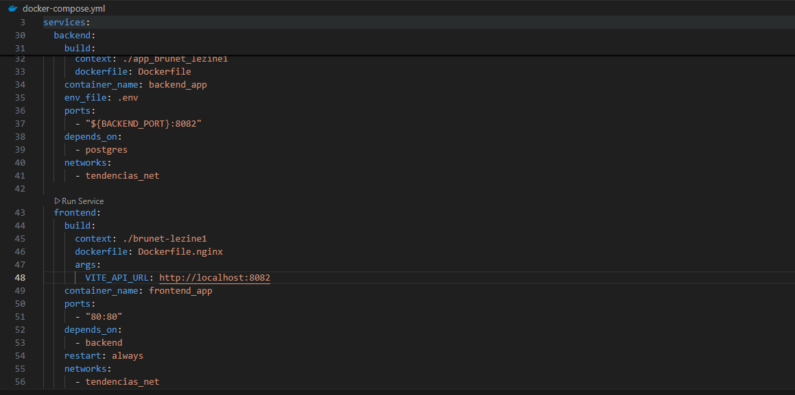

# TAS10 - Aplicación en modo producción

## 1. Título  
Contenerización de una Aplicación Frontend con Docker y Nginx

## 2. Tiempo de duración  
El tiempo fue de 200 minutos. 

## 3. Fundamentos

### Dockerfile 

Un contenedor Docker tiene una vida limitada e interactúa con su entorno. Imagina que contenedor es como un organismo vivo. Piensa en un organismo unicelular, como una célula de levadura. Siguiendo esta analogía, una imagen Docker equivale, digamos, a la información genética: todos los contenedores creados a partir de una imagen son iguales, como todos los organismos unicelulares clonados a partir de una unidad de información genética. El Dockerfile define los pasos a seguir para crear una nueva imagen. Hay que entender que se empieza siempre con una imagen base existente. La nueva imagen nace de la imagen base. Además, hay ciertos cambios puntuales. En nuestro ejemplo de la célula de levadura, los cambios serían mutaciones (¿Qué Es El Dockerfile? - IONOS, n.d.). 

### ¿Cómo funciona un Dockerfile y cómo se crea una imagen a partir de él?

Dockerfile es un archivo de texto totalmente normal. El Dockerfile contiene un conjunto de instrucciones, cada una en una línea distinta. Para crear una Docker Image, las instrucciones se ejecutan una tras otra. Quizás te suene este esquema de la ejecución de un script por lotes. Durante la ejecución, se añaden paso por paso más capas a la imagen.  Una imagen Docker se crea ejecutando las instrucciones de un Dockerfile. Este paso se conoce como el proceso build y empieza con la ejecución del comando “docker build”. El contexto de construcción es un concepto crucial: define a qué archivos y directorios tiene acceso el proceso de construcción, donde un directorio local hace las veces de fuente. El contenido del directorio fuente se transfiere al Docker Daemon al accionar “docker build”. Las instrucciones contenidas en el Dockerfile reciben acceso a los archivos y directorios contenidos en el contexto de construcción (¿Qué Es El Dockerfile? - IONOS, n.d.).

### Multi-stage buils

En una compilación tradicional, todas las instrucciones se ejecutan en secuencia y en un único contenedor: descarga de dependencias, compilación de código y empaquetado de la aplicación. Todas estas capas se convierten en la imagen final. Este enfoque funciona, pero genera imágenes voluminosas que pesan innecesariamente y aumentan los riesgos de seguridad. Aquí es donde entran en juego las compilaciones multietapa.(Compilaciones Multietapa | Documentación de Docker, n.d.)

Las compilaciones multietapa introducen varias etapas en tu Dockerfile, cada una con un propósito específico. Piénsalo como la capacidad de ejecutar diferentes partes de una compilación en múltiples entornos diferentes, simultáneamente. Al separar el entorno de compilación del entorno de ejecución final, puedes reducir significativamente el tamaño de la imagen y la vulnerabilidad de ataque. Esto es especialmente beneficioso para aplicaciones con grandes dependencias de compilación.

Se recomiendan compilaciones de varias etapas para todo tipo de aplicaciones. Para lenguajes interpretados, como JavaScript, Ruby o Python, puedes compilar y minimizar tu código en una sola etapa y copiar los archivos listos para producción a una imagen de tiempo de ejecución más pequeña. Esto optimiza tu imagen para la implementación.
Para lenguajes compilados, como C, Go o Rust, las compilaciones multietapa permiten compilar en una sola etapa y copiar los binarios compilados en una imagen de ejecución final. No es necesario incluir todo el compilador en la imagen final.(Compilaciones Multietapa | Documentación de Docker, n.d.)

### ¿Qué es la contenerización?

La contenerización permite a los desarrolladores crear e implementar aplicaciones de forma más rápida y segura. Con los métodos tradicionales, los desarrolladores escriben código en un entorno informático específico que, cuando se traslada a una nueva ubicación, suele dar lugar a fallos y errores. Por ejemplo, esto puede ocurrir cuando un desarrollador transfiere código de un ordenador de sobremesa a una máquina virtual o de un sistema operativo Linux a uno Windows. La contenerización elimina este problema al agrupar el código de la aplicación con los archivos de configuración, las bibliotecas y las dependencias relacionadas necesarias para que se ejecute. Este único paquete de software o "contenedor" se abstrae del sistema operativo anfitrión. Por lo tanto, es independiente y se vuelve portátil, capaz de ejecutarse en cualquier plataforma o nube, sin problemas.(¿Qué Es La Contenerización? | IBM, n.d.)

### Nginx

Es un servidor web de código abierto que, desde su éxito inicial como servidor web, ahora también es usado como proxy inverso, cache de HTTP, y balanceador de carga.Nginx está diseñado para ofrecer un bajo uso de memoria y alta concurrencia. En lugar de crear nuevos procesos para cada solicitud web, Nginx usa un enfoque asincrónico basado en eventos donde las solicitudes se manejan en un solo hilo. Con Nginx, un proceso maestro puede controlar múltiples procesos de trabajo. El proceso maestro mantiene los procesos de trabajo, y son estos lo que hacen el procesamiento real.(¿Qué Es NGINX y Cómo Funciona? NGINX Explicado Para Principiantes, n.d.)

Algunas características comunes que se ven en Nginx incluyen:

Proxy inverso con caché
IPv6
Balanceo de carga
Soporte FastCGI con almacenamiento en caché
Websockets
Manejo de archivos estáticos, archivos de índice y auto indexación
TLS / SSL con SNI

## 4. Conocimientos previos

El estudiante debe conocer:
- Fundamentos de Spring Boot.
- Uso básico de Node.js y React.
- Configuración básica de Nginx.
- Comandos básicos de Docker.
- Lectura y escritura de archivos `Dockerfile`.
- Uso de entornos .env para variables de configuración.
- Comunicación entre contenedores en Docker.
- Conceptos básicos de redes en Docker Compose.

## 5. Objetivos a alcanzar

- Contenerizar la aplicación frontend React usando Docker y Nginx.
- Crear un Dockerfile multi-stage para optimizar la imagen frontend.
- Contenerizar el backend y la base de datos.
- Orquestar todos los servicios mediante docker-compose.yml.
- Validar la correcta comunicación entre frontend y backend mediante variables de entorno.

## 6. Equipo necesario

- Computador.
- Navegador web.
- Conexión a internet.

## 7. Material de apoyo

- Documentación oficial de Docker.
- Cheatsheet de comandos Docker.
- Guías de React y Nginx.
- Videos tutoriales.
- Guía de asignatura.

## 8. Procedimiento

### Pasos 

1. Crear el Dockerfile para el backend.

Figura 8-1 Creación del Dockerfile para el backend.

2. Crear el Dockerfile para el frontend con multi-stage build (Node.js + Nginx).

Figura 8-2 Creación del Dockerfile para el frontend React.

3. Crear el archivo .env para definir variables de entorno.

Figura 8-3 Creación del archivo .env para variables de entorno.

4. Crear el archivo docker-compose.yml para orquestar los contenedores frontend, backend y base de datos.

Figura 8-4 Estructura del archivo docker-compose.yml.

5. Ejecutar los contenedores con docker-compose up -d.

Figura 8-5 Ejecución de los contenedores y verificación.

## 9. Resultados esperados

Al finalizar la práctica, se cumplieron exitosamente todos los objetivos planteados. La aplicación completa, compuesta por un frontend desarrollado en React y un backend en Spring Boot, fue contenerizada mediante Docker. Los servicios se orquestaron mediante un archivo docker-compose.yml, permitiendo el despliegue conjunto del frontend y backend como contenedores independientes. La base de datos fue gestionada externamente mediante Neon, una plataforma de PostgreSQL en la nube, eliminando la necesidad de levantar un contenedor local de base de datos o herramientas como pgAdmin.

Durante el proceso se logró:

- La conexión correcta entre el backend y la base de datos remota en Neon, verificada mediante los logs de Spring Boot.
- La ejecución automática de migraciones mediante Flyway al iniciar el backend, confirmando que la base de datos fue inicializada correctamente en Neon.
- La exposición de puertos y ejecución en segundo plano usando docker compose up -d, lo cual permitió el acceso a la API en el puerto 8082 y al frontend en el puerto 5173.
- La visualización en el frontend de una tabla con datos consumidos desde la API REST del backend, validando la comunicación entre ambos contenedores.
- La configuración centralizada mediante un archivo .env, lo cual facilitó la gestión de variables sensibles como las credenciales de la base de datos y las URLs de conexión.
Todo el proceso fue documentado y acompañado de evidencias, desde la construcción de imágenes hasta la correcta visualización de los datos en el navegador, demostrando el despliegue completo de una aplicación web distribuida y contenerizada.

## 10. Bibliografía
- Compilaciones multietapa | Documentación de Docker. (n.d.). Retrieved May 30, 2025, from https://docs.docker.com/get-started/docker-concepts/building-images/multi-stage-builds/
- ¿Qué es el Dockerfile? - IONOS. (n.d.). Retrieved May 16, 2025, from https://www.ionos.com/es-us/digitalguide/servidores/know-how/dockerfile/
- ¿Qué es la contenerización? | IBM. (n.d.). Retrieved June 6, 2025, from https://www.ibm.com/es-es/think/topics/containerization
- ¿Qué Es NGINX y Cómo Funciona? NGINX explicado para principiantes. (n.d.). Retrieved June 13, 2025, from https://kinsta.com/es/base-de-conocimiento/que-es-nginx/

